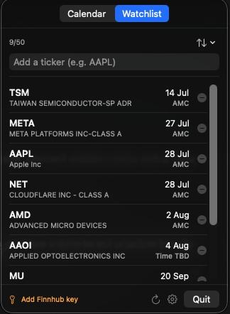
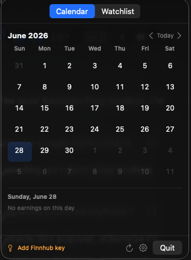
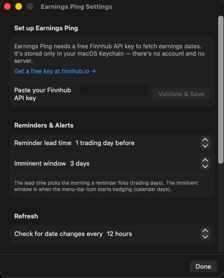

# Earnings Ping

A native macOS **menu-bar app** that tracks upcoming earnings dates for a watchlist of US stocks, so you're never blindsided by an earnings report while planning a trade.

It keeps the next earnings date for each watched ticker ambient in your menu bar, sends a timely reminder the morning before, and — critically — fires an **immediate alert when an earnings date gets rescheduled**, instead of silently overwriting it.

## Screenshots

| Watchlist | Calendar | Settings |
| :---: | :---: | :---: |
|  |  |  |

## Features

- **Watchlist** of US tickers with type-to-search autocomplete; sorted soonest-earnings-first.
- **Session badges** — `BMO` (before market open), `AMC` (after market close), `DMH` (during market hours) — so you know whether there's still time to trade. Hover a badge to see what it means.
- **Itsycal-style month calendar** highlighting upcoming earnings dates.
- **Notifications**: a reminder the morning before (configurable lead time), plus an immediate alert when a date moves.
- **Menu-bar glyph** that badges when an earnings date is imminent.
- **Bring-your-own Finnhub key** — no account, no backend. Your key lives only in your macOS Keychain.

## Requirements

- macOS 14 (Sonoma) or later
- A free **Finnhub API key** (see [Setup](#setup--finnhub-api-key))
- To build from source: Xcode 15+ and [XcodeGen](https://github.com/yonaskolb/XcodeGen)

## Setup — Finnhub API key

Earnings Ping fetches earnings dates from [Finnhub](https://finnhub.io) using a key **you** provide. There's no shared key and no server; the key is stored only in your macOS Keychain.

1. Create a free account and copy your API key from <https://finnhub.io/register>.
2. Launch Earnings Ping. On first run it opens a **"Set up Earnings Ping"** window.
3. Paste your key into the **"Paste your Finnhub API key"** field and click **Validate & Save**. The key is verified against Finnhub before it's stored.

You can change or remove the key at any time from **Settings** (`⌘,`, or the gear button in the popover).

## Build & run

```sh
make build      # xcodegen generate + xcodebuild (Debug)
make test       # run the test suite
```

The result is a menu-bar-only agent app (no Dock icon) — click the menu-bar icon to open the Watchlist / Calendar popover. Run `make help` for the full list of dev and release tasks.
